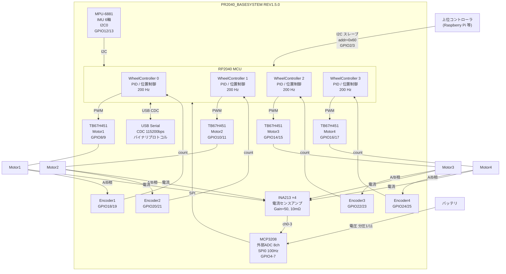
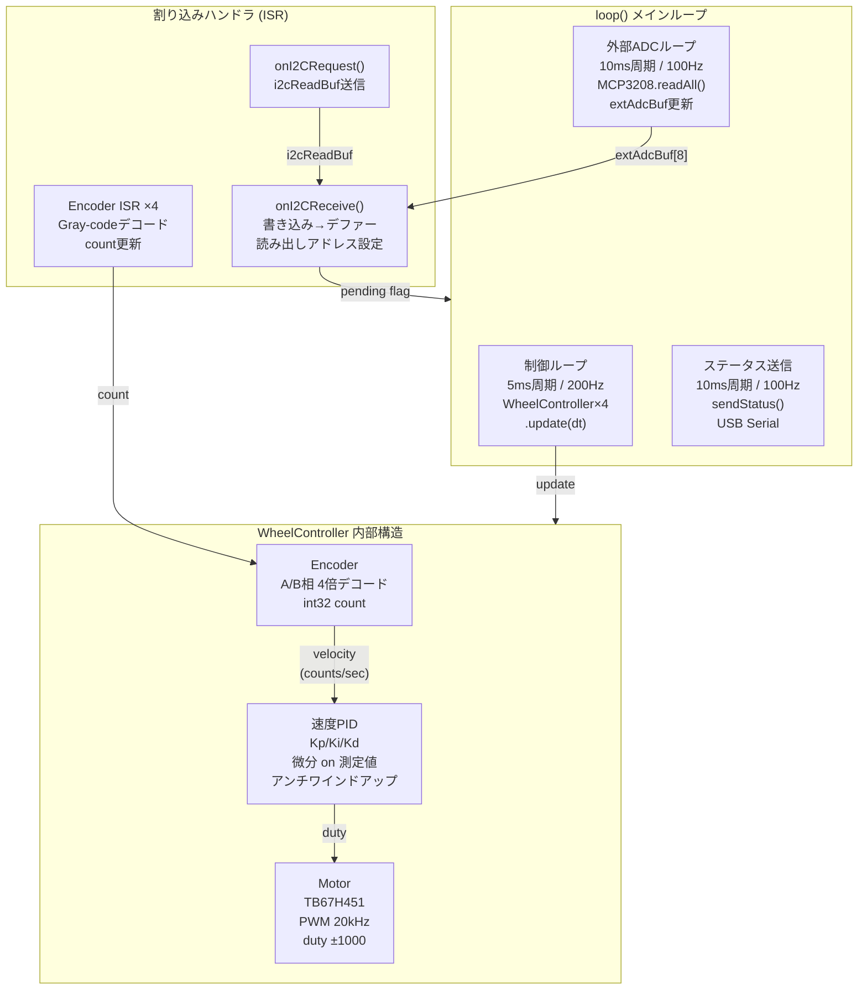
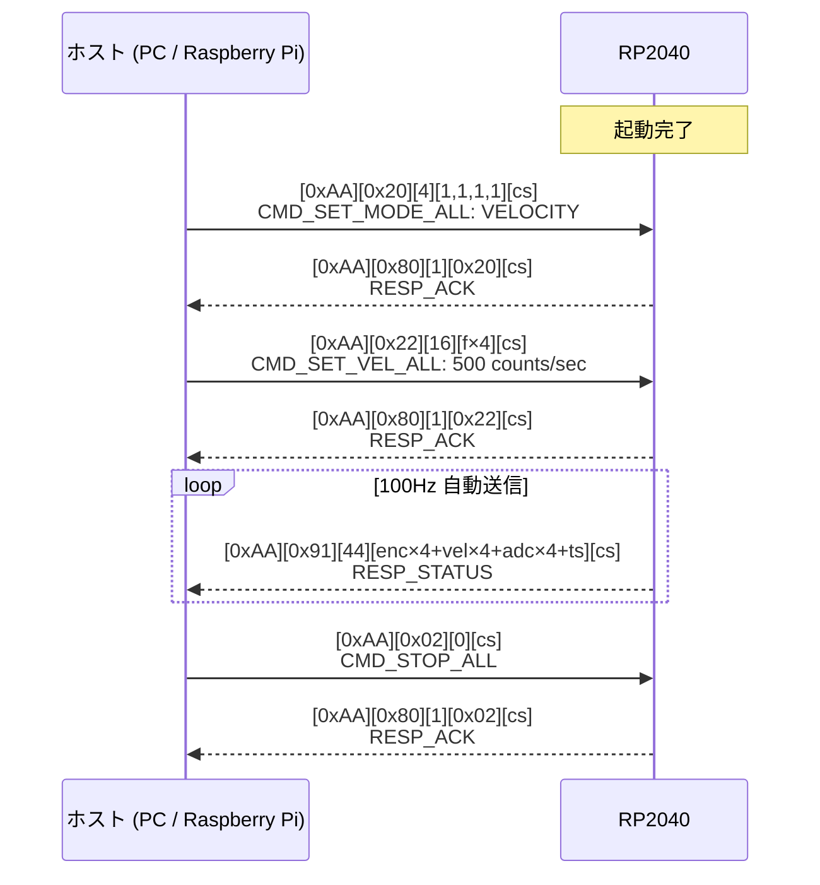
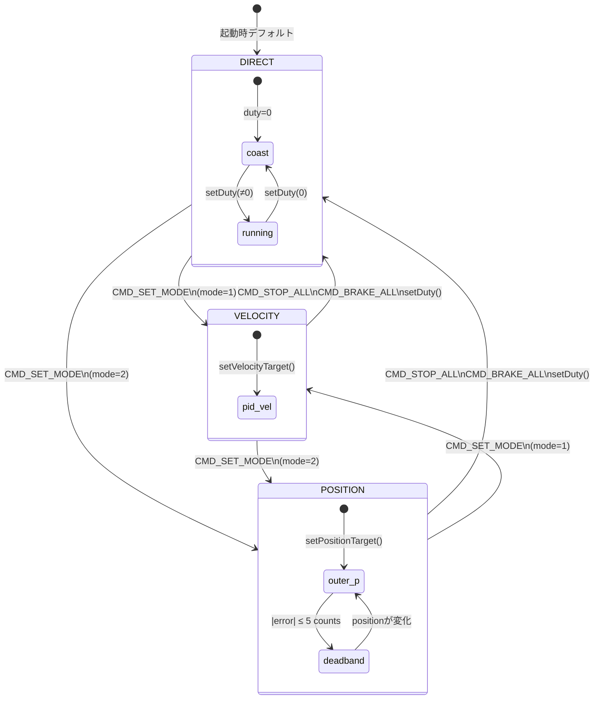

# PR2040_MotorDriver Firmware

RP2040 搭載 4ch DCモータドライバボード用 Arduino ファームウェア

- **ハードウェア**: PR2040_BASESYSTEM REV1.5.0 (N.W Works)
- **MCU**: RP2040
- **Arduinoコア**: [arduino-pico (Earle Philhower)](https://github.com/earlephilhower/arduino-pico)

---

## ファイル構成

```
PR2040_MotorDriver/
├── PR2040_MotorDriver.ino   メインスケッチ・通信プロトコル処理
├── Config.h                 GPIOピン定義・プロトコル定数・レジスタマップ
├── Motor.h / Motor.cpp      TB67H451 モータドライバクラス
├── Encoder.h / Encoder.cpp  直交エンコーダクラス（割り込みベース）
├── PID.h / PID.cpp          PIDコントローラ（アンチワインドアップ付き）
├── WheelController.h / .cpp 速度・位置制御クラス
└── README.md                本ドキュメント
```

---

## ハードウェア構成

| コンポーネント | 型番 | 個数 |
|---|---|---|
| MCU | RP2040 | 1 |
| モータドライバ | TB67H451 (H-bridge) | 4 |
| 電流センサ | INA21x SC70 | 4 |
| 外部ADC | MCP3208 / MAX11125 (SPI) | 1 |
| IMU | MPU-6881 (6軸 I2C) | 1 |
| SPI Flash | W25Q128 (16MB) | 1 |

---

## GPIOピンアサイン

### モータ制御 (TB67H451)

| モータ | IN1 | IN2 |
|---|---|---|
| Motor 1 | GPIO8 | GPIO9 |
| Motor 2 | GPIO10 | GPIO11 |
| Motor 3 | GPIO14 | GPIO15 |
| Motor 4 | GPIO16 | GPIO17 |

### エンコーダ入力

| エンコーダ | チャンネルA | チャンネルB |
|---|---|---|
| Encoder 1 (Motor 1) | GPIO18 | GPIO19 |
| Encoder 2 (Motor 2) | GPIO20 | GPIO21 |
| Encoder 3 (Motor 3) | GPIO22 | GPIO23 |
| Encoder 4 (Motor 4) | GPIO24 | GPIO25 |

### 通信・周辺機能

| 機能 | GPIO | 備考 |
|---|---|---|
| I2C1 SDA (コントローラ通信) | GPIO2 | Wire1 スレーブ |
| I2C1 SCL (コントローラ通信) | GPIO3 | Wire1 スレーブ |
| SPI0 MISO (外部ADC) | GPIO4 | |
| SPI0 CS   (外部ADC) | GPIO5 | |
| SPI0 SCK  (外部ADC) | GPIO6 | |
| SPI0 MOSI (外部ADC) | GPIO7 | |
| I2C0 SDA (MPU-6881) | GPIO12 | Wire マスタ |
| I2C0 SCL (MPU-6881) | GPIO13 | Wire マスタ |
| MPU-6881 INT | GPIO0 | 割り込み入力 |
| ADC0 電流センス | GPIO26 | Motor 1 |
| ADC1 電流センス | GPIO27 | Motor 2 |
| ADC2 電流センス | GPIO28 | Motor 3 |
| ADC3 電流センス | GPIO29 | Motor 4 |

---

## TB67H451 モータ制御ロジック

| IN1 | IN2 | 動作 |
|---|---|---|
| PWM | LOW | 正転（Forward） |
| LOW | PWM | 逆転（Reverse） |
| HIGH | HIGH | アクティブブレーキ |
| LOW | LOW | コースト（慣性停止） |

速度指令値: **-1000 〜 +1000**（正値=正転、負値=逆転、0=コースト）

PWM周波数: **20 kHz**

---

## 車輪制御モード (WheelController)

各車輪は独立した制御モードを持ちます。制御ループは **200 Hz**（5ms間隔）で実行されます。

### モード一覧

| モード | 値 | 内容 |
|---|---|---|
| DIRECT | 0 | デューティ直接指定（-1000〜+1000）。フィードバックなし |
| VELOCITY | 1 | 速度PID制御。目標値: counts/sec (signed float) |
| POSITION | 2 | 位置カスケード制御。目標値: エンコーダカウント (int32) |

### 位置制御カスケード構造

```
目標位置
    │
    ▼
[外側P] posError × posKp → 速度目標 (±maxVelCps でクリップ)
    │
    ▼
[内側PI] 速度誤差 → PID → デューティ (-1000〜+1000)
    │
    ▼
  モータ
```

位置誤差が ±5 counts 以内になるとコースト停止（デッドバンド）。

### デフォルトPIDゲイン

| パラメータ | 値 | 説明 |
|---|---|---|
| Velocity Kp | 1.0 | 速度ループ 比例ゲイン |
| Velocity Ki | 0.05 | 速度ループ 積分ゲイン |
| Velocity Kd | 0.0 | 速度ループ 微分ゲイン |
| Position posKp | 0.5 | 位置ループ 比例ゲイン |
| maxVelCps | 2000 | 位置制御時の最大速度 (counts/sec) |

速度フィルタ: **ローパスフィルタ** (α=0.4, 各制御周期で更新)

---

## I2C スレーブ通信 (Wire1)

**スレーブアドレス**: `0x60`（7bit）
**ピン**: SDA=GPIO2 / SCL=GPIO3

### レジスタマップ

#### 書き込みレジスタ（コントローラ → ボード）

| レジスタ | アドレス | データ長 | 内容 |
|---|---|---|---|
| REG_MOTOR_ALL | 0x01 | 8 B | int16 x4 モータデューティ (little-endian) |
| REG_MOTOR_SINGLE | 0x02 | 3 B | uint8 index(0-3) + int16 duty |
| REG_STOP_ALL | 0x03 | 0 B | 全モータ コースト停止 |
| REG_BRAKE_ALL | 0x04 | 0 B | 全モータ アクティブブレーキ |
| REG_RESET_ENC | 0x05 | 0 B | エンコーダカウントリセット |
| REG_SET_MODE_ALL | 0x06 | 4 B | uint8 x4 制御モード (0=DIRECT/1=VEL/2=POS) |
| REG_SET_MODE_SINGLE | 0x07 | 2 B | uint8 index + uint8 mode |
| REG_SET_VEL_ALL | 0x08 | 16 B | float x4 速度目標 (counts/sec, little-endian) |
| REG_SET_VEL_SINGLE | 0x09 | 5 B | uint8 index + float target |
| REG_SET_POS_ALL | 0x0A | 16 B | int32 x4 位置目標 (counts, little-endian) |
| REG_SET_POS_SINGLE | 0x0B | 5 B | uint8 index + int32 target |
| REG_SET_VEL_PID | 0x0C | 13 B | uint8 index + float kp, ki, kd |
| REG_SET_POS_GAINS | 0x0D | 9 B | uint8 index + float posKp, maxVelCps |

#### 読み出しレジスタ（ボード → コントローラ）

| レジスタ | アドレス | データ長 | 内容 |
|---|---|---|---|
| REG_ENC0 | 0x10 | 4 B | int32 エンコーダ0カウント |
| REG_ENC1 | 0x11 | 4 B | int32 エンコーダ1カウント |
| REG_ENC2 | 0x12 | 4 B | int32 エンコーダ2カウント |
| REG_ENC3 | 0x13 | 4 B | int32 エンコーダ3カウント |
| REG_VEL0 | 0x14 | 4 B | int32 車輪0速度 (counts/sec) |
| REG_VEL1 | 0x15 | 4 B | int32 車輪1速度 |
| REG_VEL2 | 0x16 | 4 B | int32 車輪2速度 |
| REG_VEL3 | 0x17 | 4 B | int32 車輪3速度 |
| REG_ADC0 | 0x20 | 2 B | int16 ADC ch0 (0..4095) |
| REG_ADC1 | 0x21 | 2 B | int16 ADC ch1 |
| REG_ADC2 | 0x22 | 2 B | int16 ADC ch2 |
| REG_ADC3 | 0x23 | 2 B | int16 ADC ch3 |
| REG_STATUS | 0x30 | 44 B | 全ステータス（後述） |
| REG_DEVICE_ID | 0xFF | 2 B | `0x20 0x40` |

#### REG_STATUS レイアウト (44 bytes)

```
[  0..15] int32 x4  encoder 0..3 counts (little-endian)
[ 16..31] int32 x4  velocity 0..3 (counts/sec, little-endian)
[ 32..39] int16 x4  ADC ch0..3 raw (0..4095, little-endian)
[ 40..43] uint32    timestamp (ms, millis())
```

### I2C 操作例

```
// 速度制御モード設定（全軸）
Write: [0x60+W] [0x06] [0x01, 0x01, 0x01, 0x01]

// 車輪0の速度目標設定 (500.0 counts/sec)
// float 500.0 = 0x43FA0000 (little-endian: 0x00, 0x00, 0xFA, 0x43)
Write: [0x60+W] [0x09] [0x00] [0x00, 0x00, 0xFA, 0x43]

// 車輪0の位置目標設定 (1000 counts)
Write: [0x60+W] [0x0B] [0x00] [0xE8, 0x03, 0x00, 0x00]

// 全ステータス読み出し
Write: [0x60+W] [0x30]
Read:  [0x60+R] → 44 bytes

// エンコーダ0 読み出し
Write: [0x60+W] [0x10]
Read:  [0x60+R] → 4 bytes (int32, little-endian)

// 全停止（コースト）
Write: [0x60+W] [0x03]

// デバイスID確認
Write: [0x60+W] [0xFF]
Read:  [0x60+R] → 0x20 0x40
```

---

## USB Serial 通信

**ボーレート**: 115200 bps (USB CDC)

### パケットフォーマット

```
[0xAA][CMD][LEN][DATA x LEN][CHECKSUM]
CHECKSUM = XOR(CMD, LEN, DATA[0], ..., DATA[LEN-1])
```

### コマンド一覧（ホスト → ボード）

| CMD | 値 | データ長 | 内容 |
|---|---|---|---|
| CMD_SET_MOTORS | 0x01 | 8 B | int16 x4 全モータデューティ設定 |
| CMD_STOP_ALL | 0x02 | 0 B | 全停止（コースト、DIRECT モードへ） |
| CMD_BRAKE_ALL | 0x03 | 0 B | 全ブレーキ（DIRECT モードへ） |
| CMD_SET_MOTOR_SINGLE | 0x04 | 3 B | uint8 index + int16 duty |
| CMD_REQUEST_STATUS | 0x10 | 0 B | ステータス1回送信 |
| CMD_RESET_ENCODERS | 0x11 | 0 B | エンコーダリセット |
| CMD_SET_MODE_ALL | 0x20 | 4 B | uint8 x4 制御モード設定 |
| CMD_SET_MODE_SINGLE | 0x21 | 2 B | uint8 index + uint8 mode |
| CMD_SET_VEL_ALL | 0x22 | 16 B | float x4 速度目標 (counts/sec) |
| CMD_SET_VEL_SINGLE | 0x23 | 5 B | uint8 index + float target |
| CMD_SET_POS_ALL | 0x24 | 16 B | int32 x4 位置目標 (counts) |
| CMD_SET_POS_SINGLE | 0x25 | 5 B | uint8 index + int32 target |
| CMD_SET_VEL_PID | 0x26 | 13 B | uint8 index + float kp, ki, kd |
| CMD_SET_POS_GAINS | 0x27 | 9 B | uint8 index + float posKp, maxVelCps |

### レスポンス（ボード → ホスト）

| TYPE | 値 | データ長 | 内容 |
|---|---|---|---|
| RESP_ACK | 0x80 | 1 B | [echo cmd] コマンド受理 |
| RESP_NAK | 0x81 | 1 B | [echo cmd] コマンドエラー |
| RESP_STATUS | 0x91 | 44 B | REG_STATUSと同レイアウト |

ステータスは **100 Hz**（10ms間隔）で自動送信されます。

### シリアル操作例

```python
import struct, serial

ser = serial.Serial('COM3', 115200)

def send_cmd(cmd, data=b''):
    pkt = bytes([0xAA, cmd, len(data)]) + data
    cs = cmd ^ len(data)
    for b in data:
        cs ^= b
    ser.write(pkt + bytes([cs]))

# 速度制御モードに設定（全軸）
send_cmd(0x20, bytes([1, 1, 1, 1]))

# 車輪0の速度目標 500.0 counts/sec
send_cmd(0x23, bytes([0]) + struct.pack('<f', 500.0))

# 全軸位置目標設定 (1000 counts)
send_cmd(0x24, struct.pack('<iiii', 1000, 1000, 1000, 1000))

# 全停止
send_cmd(0x02)
```

---

## ビルド方法

1. [arduino-pico](https://github.com/earlephilhower/arduino-pico) をArduino IDEに追加
   - Board Manager URL: `https://github.com/earlephilhower/arduino-pico/releases/download/global/package_rp2040_index.json`
2. ボード選択: **Raspberry Pi Pico** (または RP2040 互換ボード)
3. `PR2040_MotorDriver.ino` を開いてビルド・書き込み

### 必要ライブラリ

| ライブラリ | 用途 | 入手先 |
|---|---|---|
| Wire (built-in) | I2C通信 | arduino-pico 同梱 |

外部ライブラリの追加は不要です。

---

## エンコーダ仕様

- 直交エンコーダ（A相・B相）をGPIO割り込みで4倍デコード
- 両チャンネルに `CHANGE` 割り込みを設定
- カウント値: `int32_t`（符号付き32bit、オーバーフローまで約21億パルス）
- スレッドセーフ: `getCount()` / `resetCount()` は割り込み禁止区間で保護
- Gray-codeルックアップテーブルによる高速デコード

---

## システム構成

### ハードウェアブロック図



### ソフトウェア構成図



### 通信シーケンス図



### 制御モード 状態遷移図



### 制御ループ タイミング図

```mermaid
gantt
    title 制御ループ タイミング (1周期 = 1ms 単位)
    dateFormat x
    axisFormat %Lms

    section 制御ループ (200Hz)
    WheelCtrl update ×4 : 0, 1
    WheelCtrl update ×4 : 5, 1
    WheelCtrl update ×4 : 10, 1
    WheelCtrl update ×4 : 15, 1
    WheelCtrl update ×4 : 20, 1
    WheelCtrl update ×4 : 25, 1

    section 外部ADC (100Hz)
    MCP3208 readAll : 0, 2
    MCP3208 readAll : 10, 2
    MCP3208 readAll : 20, 2

    section ステータス送信 (100Hz)
    sendStatus → USB : 0, 1
    sendStatus → USB : 10, 1
    sendStatus → USB : 20, 1
```



### センサ変換パラメータ

| チャンネル | 物理量 | 変換式 | スケール |
|---|---|---|---|
| ch0-3 | モータ電流 [A] | count × Vref / (4096 × gain × Rshunt) | ~1.611 mA/count |
| ch4 | バッテリ電圧 [V] | count × Vref × (R_upper+R_lower)/R_lower / 4096 | ~8.862 mV/count |

- **Vref** = 3.3V、**ADCフルスケール** = 4096 counts (12bit)
- **INA213**: gain=50 V/V、Rshunt=10 mΩ → 最大計測電流 6.6 A
- **電圧分圧**: R_upper=100 kΩ / R_lower=10 kΩ → 分圧比 1/11 → 最大計測電圧 36.3 V

### I2C 外部ADC・物理値レジスタ（追加）

| レジスタ | アドレス | データ長 | 内容 |
|---|---|---|---|
| REG_EXT_ADC0 | 0x40 | 2 B | int16 MCP3208 ch0 raw (0..4095) |
| REG_EXT_ADC1 | 0x41 | 2 B | int16 MCP3208 ch1 raw |
| REG_EXT_ADC2 | 0x42 | 2 B | int16 MCP3208 ch2 raw |
| REG_EXT_ADC3 | 0x43 | 2 B | int16 MCP3208 ch3 raw |
| REG_EXT_ADC4 | 0x44 | 2 B | int16 MCP3208 ch4 raw |
| REG_EXT_ADC_ALL | 0x48 | 16 B | int16 x8 全チャンネル一括 |
| REG_CURR0 | 0x50 | 4 B | float Motor1電流 [A] |
| REG_CURR1 | 0x51 | 4 B | float Motor2電流 [A] |
| REG_CURR2 | 0x52 | 4 B | float Motor3電流 [A] |
| REG_CURR3 | 0x53 | 4 B | float Motor4電流 [A] |
| REG_VBATT | 0x54 | 4 B | float バッテリ電圧 [V] |
