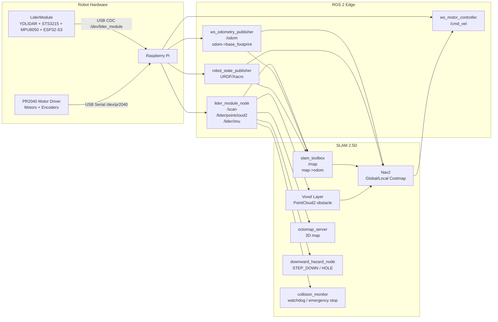

# SLAM 2.5D システム要件定義書

対象リポジトリ: `/home/pi/MobileRobot`  
対象モジュール: `LiderModule`, `mobile_robot_edge`, `mobile_robot_server`, `edge_services`  
作成目的: ClaudeCode / Codex による実装タスク生成に耐える粒度で、LiderModule を用いた移動ロボット向け SLAM 2.5D システムの要件を定義する。

## 1. 目的

本システムは、移動ロボットに搭載した `LiderModule` の 2D LaserScan とチルト式 3D PointCloud を用いて、室内環境の地図作成、自己位置推定、経路計画、局所障害物回避、段差/穴検出を実現する。

本書でいう **SLAM 2.5D** は、以下の構成を指す。

- グローバル地図と大域経路計画は 2D OccupancyGrid 上で行う。
- LiderModule の水平スライスから `/scan` を生成し、`slam_toolbox` で `/map` と `map -> odom` を生成する。
- LiderModule の下向きチルトスキャンから `/lider/pointcloud2` を生成し、Nav2 local costmap の `voxel_layer`、OctoMap、段差/穴検出へ入力する。
- ロボット制御は既存の `/cmd_vel`、`/odom`、`odom -> base_footprint` を継承する。

点群のみで自己位置推定を行うフル 3D SLAM は対象外とする。初期実装では 2D SLAM を中核に据え、高さ情報は「局所障害物」「床面リスク」「3D 記録」のために使用する。

## 2. 参照すべき既存仕様とコード

実装者は、以下のファイルを優先して参照すること。

| 優先度 | ファイル | 用途 |
|---|---|---|
| 高 | `LiderModule/SPEC.md` | LiderModule のハードウェア、USB CDC プロトコル、座標系、性能値 |
| 高 | `LiderModule/docs/USB_CDC_COMMAND_MANUAL.md` | ホスト実装に必要なバイナリフレーム仕様 |
| 高 | `LiderModule/firmware/lidar_tilt_3d/lidar_tilt_3d.ino` | ESP32-S3 ファームウェアの実動作 |
| 高 | `LiderModule/host/rpi_tilt_3d.py` | USB CDC パース、点群再構成、PLY/CSV 保存の参照実装 |
| 高 | `LiderModule/host/downward_hazard_monitor.py` | 段差/穴検出の参照実装 |
| 高 | `mobile_robot_edge/mobile_robot_edge/lider_module_node.py` | ROS 2 Topic 化の現行実装 |
| 高 | `mobile_robot_edge/launch/ws_edge_bringup.launch.py` | edge 側 bringup、TF、LiderModule 起動設定 |
| 高 | `edge_services/config/robot_config.json` | wheel odometry、motor service、WebSocket、USB ポート設定 |
| 高 | `mobile_robot_server/config/slam_toolbox_params.yaml` | 既存 2D SLAM 設定 |
| 高 | `mobile_robot_server/config/nav2_params.yaml` | 既存 Nav2 設定 |
| 高 | `mobile_robot_server/launch/server_bringup.launch.py` | サーバ側 bringup と Nav2 lifecycle 構成 |

## 3. 現行システムの前提

### 3.1 LiderModule

`LiderModule` は、YDLIDAR T-mini Pro を FEETECH STS3215 サーボでチルトさせ、XIAO ESP32-S3 が LiDAR、サーボ角、MPU6050 DMP 姿勢を USB CDC バイナリプロトコルで Raspberry Pi へ送信するモジュールである。

主要仕様:

| 項目 | 現行値 |
|---|---|
| LiDAR | YDLIDAR T-mini Pro |
| LiDAR range | 0.02 m から 12.0 m |
| LiDAR 回転 | 約 6 Hz |
| LiDAR UART | 230400 bps |
| チルトサーボ | STS3215, ID 1, center 2048 |
| チルト範囲 | 運用上 -45 deg から +45 deg、保護上限 -50 deg から +50 deg |
| IMU | MPU6050 DMP、pitch/roll/yaw を送信、yaw は相対方位 |
| USB CDC | 921600 bps 設定、DTR/RTS false 推奨 |
| フレーム同期 | `[0xFE][0xEF][TYPE][LEN_L][LEN_H][PAYLOAD][CHECKSUM]` |

### 3.2 ROS 2 edge 側

`mobile_robot_edge/mobile_robot_edge/lider_module_node.py` は現状で以下を発行する。

| Topic | 型 | 用途 | 現行周期 |
|---|---|---|---|
| `/scan` | `sensor_msgs/msg/LaserScan` | 2D SLAM、障害物 layer | 約 5 から 6 Hz |
| `/lider/pointcloud2` | `sensor_msgs/msg/PointCloud2` | 3D 障害物、OctoMap、床面リスク | 既定 30 秒周期 |
| `/lider/imu` | `sensor_msgs/msg/Imu` | 姿勢情報の将来利用 | IMU 受信時、約 50 Hz |

ただし、`/lider/imu` の現行 ROS メッセージは orientation quaternion、angular velocity、linear acceleration を未充填とし、covariance で unknown を示している。したがって、初期実装では robot_localization の融合入力として使わない。

### 3.3 走行系

`edge_services/config/robot_config.json` と `mobile_robot_edge` の WebSocket bridge により、以下のインターフェースが存在する。

| Topic / Service | 役割 |
|---|---|
| `/odom` | wheel odometry |
| `odom -> base_footprint` | wheel odometry TF |
| `/cmd_vel` | Nav2 から motor service への速度指令 |
| `ws_motor_controller` | `/cmd_vel` を motor service へ転送 |
| `ws_odometry_publisher` | odometry service から `/odom` と TF を発行 |

現行 `robot_config.json` では motor、odometry、hardware がいずれも `/dev/ttyACM0` を使う設定になっている。LiderModule も launch 上で `/dev/ttyACM0` を使うため、このままでは USB ポート競合が起きる。

### 3.4 server 側

`mobile_robot_server` には、`slam_toolbox`、Nav2、collision monitor、velocity smoother、LLM navigation などの構成が存在する。既存の `nav2_params.yaml` は `/scan` を obstacle source として扱うが、`/lider/pointcloud2` を用いた voxel layer はまだ定義されていない。

## 4. システム全体構成



## 5. 機能要件

### F-01 LiderModule ROS 2 ドライバ

`lider_module_node` は、USB CDC から LiderModule バイナリフレームを読み取り、ROS 2 標準メッセージへ変換する。

必須要件:

- 起動パラメータ `port` の既定を `/dev/lider_module` に変更できること。
- baudrate は `921600` を使用すること。
- serial open 後に DTR/RTS を false にすること。
- `0x02` IMU、`0x04` ScanSlice、`0x05` ScanStatus を受信できること。
- `0x10` Servo Angle、`0x12` Scan Start、`0x13` Scan Stop を送信できること。
- 受信処理は専用 thread で非ブロッキングに行うこと。
- shutdown 時は `CMD_SCAN_STOP` と `CMD_SERVO_ANGLE(0.0)` を送信すること。

実装修正要求:

- `LiderModule/docs/USB_CDC_COMMAND_MANUAL.md` の拡張 ScanSlice header `22 + count * 5` を正式にサポートすること。
- 旧形式 `14 + count * 5` も互換サポートし、旧形式では `tilt_start = tilt_end = tilt_deg` として扱うこと。
- 拡張形式では点ごとのチルト角を `tilt_start_deg -> tilt_end_deg` で線形補間し、サーボ移動中の螺旋スキャンとして 3D 座標へ変換すること。
- `ScanSlice` dataclass は `tilt_deg`, `tilt_start_deg`, `tilt_end_deg`, `imu_pitch`, `imu_roll`, `points` を持つこと。
- quality filter のパラメータ `min_quality` を追加し、既定値は `0` とすること。

### F-02 `/scan` 生成

`/scan` は `LaserScan` として発行し、2D SLAM と Nav2 obstacle layer の入力とする。

必須要件:

- frame_id は `laser_frame` とする。
- angle range は `-pi` から `+pi` とする。
- bins は既定 `720` とし、約 0.5 deg 分解能を維持する。
- range_min は `0.02`、range_max は `12.0` を既定とする。
- range 外の値は `inf` とする。
- 同一 bin に複数点が入る場合、最短距離を採用する。
- scan_time は T-mini Pro の実測に合わせて既定 `1.0 / 6.0` とする。
- Nav2 で chassis 反射を避けるため、costmap 側では `obstacle_min_range` を `0.15` 以上に設定する。

受入基準:

- `ros2 topic hz /scan` が 5 Hz 以上を 10 分間維持する。
- `ros2 topic echo /scan --once` で frame_id、range_min、range_max、ranges が妥当である。
- RViz で水平スキャンが `laser_frame` に表示される。

### F-03 `/lider/pointcloud2` 生成

`/lider/pointcloud2` は `PointCloud2` として発行し、3D 障害物、床面リスク、OctoMap の入力とする。

必須要件:

- frame_id は `laser_frame` とする。
- fields は最低限 `x`, `y`, `z` の `float32` とする。
- 単位は meter とする。
- 座標系は `X: 前方`, `Y: 左方`, `Z: 上方` とする。
- `tilt_axis_offset_m` を反映すること。
- IMU pitch/roll による姿勢補正を適用できること。
- `pointcloud_interval_s` は 0 で無効化、正の値で周期実行とする。
- 実運用既定値は `2.0` 秒とする。現行の `30.0` 秒はデバッグ用途とする。
- 1 回の pointcloud 生成に使用する下向き角度列は、既存 `DOWN_ANGLES` を初期値として維持する。

受入基準:

- `ros2 topic hz /lider/pointcloud2` が設定周期に従う。
- RViz で下向き点群が `laser_frame` 基準に表示される。
- `pointcloud_interval_s:=2.0` で 10 分間、ノードが timeout 連発せず動作する。

### F-04 `/lider/imu` 生成

`/lider/imu` は `sensor_msgs/msg/Imu` として発行する。

初期必須要件:

- frame_id は `imu_link` とする。
- 現行 firmware から受信する pitch/roll/yaw はログまたは diagnostic 用に保持する。
- orientation quaternion が未計算の場合、orientation covariance の先頭を `-1.0` とし、融合不可を明示する。
- angular velocity と linear acceleration が未提供の場合、それぞれ covariance の先頭を `-1.0` とする。

拡張要件:

- robot_localization へ入力する場合、pitch/roll/yaw から quaternion を生成し、yaw が相対方位である制約を明記する。
- angular velocity と linear acceleration を使う場合は firmware 側 payload 拡張を別タスクとする。

### F-05 TF / URDF

TF tree は以下を満たす。

```text
map -> odom -> base_footprint -> base_link -> laser_frame -> imu_link
                                      |
                                      -> camera_optical_frame
```

必須要件:

- `map -> odom` は `slam_toolbox` が発行する。
- `odom -> base_footprint` は `ws_odometry_publisher` が発行する。
- `base_footprint -> base_link -> laser_frame -> imu_link` は `robot_state_publisher` が URDF/Xacro から発行する。
- launch 内 inline URDF は廃止し、`mobile_robot_edge/urdf/mobile_robot.urdf.xacro` または共通 package の URDF へ外出しする。
- `laser_frame` の位置は現行仮値 `(x=0.05, y=0.0, z=0.08)` から、実機計測値へ更新可能な xacro property とする。
- `base_footprint -> base_link` の z は現行仮値 `0.033` を初期値とし、実測可能にする。

受入基準:

- `ros2 run tf2_tools view_frames` で tree が一意につながる。
- `ros2 run tf2_ros tf2_echo map laser_frame` が SLAM 起動後に解決できる。
- RViz fixed frame `map` で robot model、scan、pointcloud が同時表示できる。

### F-06 2D SLAM

2D SLAM は `slam_toolbox` を標準実装とする。

必須要件:

- 入力 topic は `/scan` と `/odom` と `/tf` とする。
- 出力 topic は `/map` とし、`map -> odom` TF を発行する。
- 既存 `mobile_robot_server/config/slam_toolbox_params.yaml` を基準に、LiderModule 用として維持する。
- map resolution は `0.05` m/cell を既定とする。
- `base_frame` は `base_footprint` とする。
- `max_laser_range` は `12.0` とする。
- map save の手順を launch または README に定義する。

受入基準:

- 5 m 四方以上の室内走行で `/map` が生成される。
- `map -> odom` が 20 Hz 以上で発行される。
- 保存した map を Nav2 global costmap に読み込める。

### F-07 Nav2 2.5D costmap

Nav2 は 2D global costmap と 2.5D local costmap を持つ。

global costmap 要件:

- `global_frame` は `map`。
- `robot_base_frame` は `base_footprint`。
- `static_layer` は `/map` を購読する。
- `inflation_layer` を有効化する。
- resolution は `0.05` m/cell。

local costmap 要件:

- `global_frame` は `odom`。
- `robot_base_frame` は `base_footprint`。
- rolling window を有効化する。
- 初期 width/height は `3.0` m 以上、推奨 `4.0` から `6.0` m。
- `obstacle_layer` は `/scan` を `LaserScan` として購読する。
- `voxel_layer` は `/lider/pointcloud2` を `PointCloud2` として購読する。
- `inflation_layer` を有効化する。
- `obstacle_min_range` は `0.15` m 以上とし、ロボット自身の反射を除外する。
- `max_obstacle_height` は初期値 `1.5` m とする。
- `z_resolution` は `0.05` m、`z_voxels` は初期値 `16` とする。

受入基準:

- `/scan` の障害物が local costmap に反映される。
- `/lider/pointcloud2` の立体障害物が local costmap の voxel layer に反映される。
- Nav2 が `/cmd_vel` を出力し、`ws_motor_controller` 経由で走行系へ届く。

### F-08 OctoMap

OctoMap は 3D 記録と可視化のために導入する。Nav2 の必須経路計画には使わない。

必須要件:

- 入力は `/lider/pointcloud2` とする。
- frame は TF で `map` または `odom` へ変換可能であること。
- octomap resolution は初期値 `0.05` m とする。
- `.bt` または `.ot` 形式で保存できること。
- CPU 負荷が高い場合は更新周期または resolution を落とせること。

受入基準:

- 1 分以上の走行後、OctoMap を保存できる。
- RViz または外部 viewer で 3D map を確認できる。

### F-09 段差/穴検出

段差/穴検出は `LiderModule/host/downward_hazard_monitor.py` の考え方を ROS 2 node 化する。

新規 node 名:

- `downward_hazard_node`

入力:

- `/lider/pointcloud2`
- `/tf`

出力:

| Topic | 型 | 内容 |
|---|---|---|
| `/hazard/downward_status` | `std_msgs/msg/String` | `SAFE`, `STEP_DOWN`, `HOLE`, `UNKNOWN` |
| `/hazard/downward_debug` | `diagnostic_msgs/msg/DiagnosticArray` | 閾値、点数、理由 |
| `/hazard/downward_stop` | `std_msgs/msg/Bool` | 走行停止要求 |

必須要件:

- forward lane ROI を `X` と `Y` の範囲で設定できること。
- 近傍床面 ROI から reference ground z を percentile で推定すること。
- x 方向 bin ごとの床面 profile を作ること。
- 急な負方向 z 変化を `STEP_DOWN` と判定すること。
- sparse bin または reference から深い z を `HOLE` と判定すること。
- 点数不足時は `UNKNOWN` とすること。
- パラメータは YAML 化すること。

初期パラメータ:

| パラメータ | 初期値 |
|---|---:|
| `eval_x_min` | 0.15 |
| `eval_x_max` | 1.20 |
| `eval_y_half` | 0.20 |
| `bin_size` | 0.05 |
| `step_drop_m` | 0.08 |
| `hole_depth_m` | 0.10 |
| `min_points_for_eval` | 200 |
| `min_points_per_bin` | 3 |

受入基準:

- 平坦床で `SAFE` を出す。
- 0.10 m 以上の下り段差で `STEP_DOWN` または `HOLE` を出す。
- 点群欠落時に `UNKNOWN` を出し、必要に応じて停止要求を出す。

### F-10 安全停止

安全停止は多層で実装する。

必須要件:

- hardware emergency stop を設け、モータ電源を物理的に遮断できること。
- `edge_services` の `cmd_vel_timeout` を維持し、無通信時に停止すること。
- Nav2 `collision_monitor` を lifecycle 管理対象に含めること。
- `collision_monitor` は `/scan` を監視し、前方停止 polygon で停止できること。
- `downward_hazard_node` が危険を出した場合、Nav2 を介さず停止指令を出せる構成を用意すること。
- LiderModule node が serial disconnected を検知した場合、diagnostic と停止要求を出せること。

受入基準:

- `/cmd_vel` が途絶えた場合、0.5 秒以内に motor service が停止する。
- 前方停止 polygon 内に障害物を置いた場合、ロボットが停止する。
- `/lider/pointcloud2` 欠落または LiderModule 切断時に安全側へ倒れる。

## 6. 非機能要件

### 6.1 実行環境

| 項目 | 要件 |
|---|---|
| ROS 2 | Jazzy Jalisco に統一 |
| OS | Ubuntu 24.04 arm64 推奨。Docker 実行も可 |
| SBC | Raspberry Pi 5 8GB 推奨、Raspberry Pi 4 4GB は縮退運用 |
| Python | ROS 2 Jazzy 標準 Python |
| 依存 | `pyserial`, `numpy`, `websockets`, Nav2, slam_toolbox, robot_state_publisher, octomap_server |

### 6.2 性能

| 項目 | 要件 |
|---|---|
| `/scan` | 5 Hz 以上 |
| `/odom` | 50 Hz 維持 |
| `/lider/imu` | 50 Hz 目標 |
| `/lider/pointcloud2` | 実運用 0.2 から 1.0 Hz、初期値 0.5 Hz |
| local costmap update | 5 Hz 目標 |
| global costmap update | 1 Hz 目標 |
| 停止レイテンシ | 300 ms 目標、500 ms 上限 |
| 連続稼働 | 最低 30 分 |

### 6.3 信頼性

- USB ポート名は udev で固定する。
- `/dev/ttyACM0` を直接本番設定に書かない。
- `lider_module_node`、WebSocket bridge、Nav2 lifecycle node は respawn または lifecycle で復旧可能にする。
- sensor timeout を diagnostic に出す。
- rosbag2 で `/scan`, `/lider/pointcloud2`, `/lider/imu`, `/odom`, `/tf`, `/cmd_vel`, `/map` を記録できること。

### 6.4 セキュリティ

- 単機運用時、`edge_services` の host は `127.0.0.1` を既定とする。
- 外部 PC へ公開する場合のみ `0.0.0.0` を明示的に使う。
- Docker 本番運用では `privileged: true` と `network_mode: host` の利用を再評価し、必要最小権限にする。

## 7. インターフェース仕様

### 7.1 ROS Topics

| Topic | 型 | Publisher | Subscriber | 必須 |
|---|---|---|---|---|
| `/scan` | `sensor_msgs/msg/LaserScan` | `lider_module_node` | `slam_toolbox`, Nav2, collision monitor | 必須 |
| `/lider/pointcloud2` | `sensor_msgs/msg/PointCloud2` | `lider_module_node` | voxel layer, OctoMap, hazard node | 必須 |
| `/lider/imu` | `sensor_msgs/msg/Imu` | `lider_module_node` | diagnostics, future EKF | 必須 |
| `/odom` | `nav_msgs/msg/Odometry` | `ws_odometry_publisher` | SLAM, Nav2 | 必須 |
| `/cmd_vel` | `geometry_msgs/msg/Twist` | Nav2 / safety | `ws_motor_controller` | 必須 |
| `/map` | `nav_msgs/msg/OccupancyGrid` | `slam_toolbox` | Nav2 global costmap | 必須 |
| `/tf` | `tf2_msgs/msg/TFMessage` | SLAM, odom, RSP | all | 必須 |
| `/tf_static` | `tf2_msgs/msg/TFMessage` | RSP | all | 必須 |
| `/octomap_binary` | `octomap_msgs/msg/Octomap` | `octomap_server` | RViz / saver | 任意 |
| `/hazard/downward_status` | `std_msgs/msg/String` | `downward_hazard_node` | safety / UI | 必須 |
| `/hazard/downward_stop` | `std_msgs/msg/Bool` | `downward_hazard_node` | safety mux | 必須 |

### 7.2 USB CDC messages

LiderModule USB CDC は以下を必須サポートとする。

| Direction | Type | 名称 | Payload |
|---|---:|---|---|
| ESP32 -> RPi | `0x02` | IMU data | `pitch_f32, roll_f32, yaw_f32` |
| ESP32 -> RPi | `0x04` | 3D scan slice | 拡張 header 22 byte + points |
| ESP32 -> RPi | `0x05` | scan status | `state_u8, step_u16, total_u16` |
| RPi -> ESP32 | `0x10` | servo angle | `angle_deg_f32` |
| RPi -> ESP32 | `0x12` | scan start | `tilt_min_f32, tilt_max_f32, tilt_step_f32` |
| RPi -> ESP32 | `0x13` | scan stop | empty |

### 7.3 設定ファイル

新規または修正対象の設定ファイル:

```text
mobile_robot_edge/
  config/
    lider_module.yaml
    edge_bridge.yaml
    hazard_downward.yaml
  launch/
    sensors.launch.py
    edge_25d_bringup.launch.py
  urdf/
    mobile_robot.urdf.xacro

mobile_robot_server/
  config/
    slam_toolbox_params.yaml
    nav2_25d_params.yaml
    octomap_params.yaml
  launch/
    slam_25d.launch.py
    nav2_25d.launch.py
    octomap.launch.py
    server_25d_bringup.launch.py

scripts/
  install_udev_rules.sh
  99-mobilerobot.rules
```

## 8. 実装タスク定義

ClaudeCode / Codex へ依頼する際は、以下の単位で分割する。

### T-01 USB CDC parser の拡張

対象:

- `mobile_robot_edge/mobile_robot_edge/lider_module_node.py`
- unit test

要件:

- 拡張 ScanSlice header 22 byte を parse する。
- 旧 header 14 byte を parse する。
- checksum 不一致、payload 長不足、count と実 payload 不一致を安全に破棄する。
- `tilt_start_deg`, `tilt_end_deg` を pointcloud 変換へ反映する。

完了条件:

- `python -m pytest` または `colcon test` で parser test が通る。
- 既存旧形式の fixture と新形式の fixture の両方が通る。

### T-02 LiderModule パラメータ YAML 化

対象:

- `mobile_robot_edge/config/lider_module.yaml`
- `mobile_robot_edge/launch/sensors.launch.py`

要件:

- launch 内の LiderModule パラメータ直書きを廃止する。
- port 既定を `/dev/lider_module` にする。
- `pointcloud_interval_s` 既定を `2.0` にする。
- `min_quality` を追加する。

完了条件:

- `ros2 launch mobile_robot_edge sensors.launch.py` で node が起動する。

### T-03 URDF/Xacro 化

対象:

- `mobile_robot_edge/urdf/mobile_robot.urdf.xacro`
- `mobile_robot_edge/launch/sensors.launch.py`
- `mobile_robot_server/launch/server_25d_bringup.launch.py`

要件:

- inline URDF を廃止する。
- `base_footprint`, `base_link`, `laser_frame`, `imu_link`, `camera_optical_frame` を定義する。
- xacro property で robot size、laser pose、camera pose を調整可能にする。

完了条件:

- `robot_state_publisher` が xacro 由来の robot_description で起動する。
- TF tree が一意に接続される。

### T-04 udev 固定デバイス名

対象:

- `scripts/99-mobilerobot.rules`
- `scripts/install_udev_rules.sh`
- README または setup doc

要件:

- LiderModule を `/dev/lider_module` に固定する。
- PR2040 motor driver を `/dev/pr2040` に固定する。
- VID/PID が同一で区別不能な場合は serial attribute または physical path を使う。
- `robot_config.json` と LiderModule launch から `/dev/ttyACM0` 直指定を排除する。

完了条件:

- USB 抜き差し後も symlink が維持される。

### T-05 Nav2 2.5D params

対象:

- `mobile_robot_server/config/nav2_25d_params.yaml`
- `mobile_robot_server/launch/nav2_25d.launch.py`

要件:

- 既存 Nav2 設定を複製せず、必要に応じて 2.5D 用ファイルへ整理する。
- local costmap に `obstacle_layer`, `voxel_layer`, `inflation_layer` を定義する。
- `voxel_layer` の observation source に `/lider/pointcloud2` を設定する。
- `collision_monitor` を lifecycle 管理対象へ含める。

完了条件:

- Nav2 lifecycle nodes が active になる。
- `/scan` と `/lider/pointcloud2` が local costmap に反映される。

### T-06 OctoMap 統合

対象:

- `mobile_robot_server/config/octomap_params.yaml`
- `mobile_robot_server/launch/octomap.launch.py`

要件:

- `/lider/pointcloud2` から OctoMap を構築する。
- resolution、max_range、frame_id を YAML 化する。
- 保存コマンドを README に記載する。

完了条件:

- `.bt` または `.ot` ファイル保存に成功する。

### T-07 downward_hazard_node

対象:

- `mobile_robot_edge/mobile_robot_edge/downward_hazard_node.py`
- `mobile_robot_edge/config/hazard_downward.yaml`
- tests

要件:

- `downward_hazard_monitor.py` の `compute_hazard()` を ROS node 化する。
- PointCloud2 を numpy 配列に変換する。
- `SAFE`, `STEP_DOWN`, `HOLE`, `UNKNOWN` を publish する。
- 危険時に `/hazard/downward_stop` を true にする。

完了条件:

- unit test で平坦床、段差、穴、点数不足を判定できる。

### T-08 rosbag2 記録と再生

対象:

- `scripts/record_25d_bag.sh`
- `scripts/play_25d_bag.sh`

記録 topic:

```bash
/scan
/lider/pointcloud2
/lider/imu
/odom
/tf
/tf_static
/cmd_vel
/map
/hazard/downward_status
```

完了条件:

- 実機なしでも rosbag replay で SLAM / hazard / costmap の回帰確認ができる。

## 9. 受入試験

### 9.1 単体試験

| 試験 | 条件 | 合格基準 |
|---|---|---|
| USB frame checksum | 正常/異常 frame | 正常のみ decode |
| ScanSlice 旧形式 | 14 byte header | `tilt_start == tilt_end == tilt` |
| ScanSlice 新形式 | 22 byte header | tilt 補間が有効 |
| LaserScan binning | 同一 bin 複数点 | 最短距離を採用 |
| PointCloud transform | 既知角度/距離 | 期待座標との差が 1 cm 以下 |
| Hazard flat | 平坦点群 | `SAFE` |
| Hazard step | 下り段差点群 | `STEP_DOWN` |
| Hazard hole | 欠落/深い床面 | `HOLE` |

### 9.2 統合試験

| 試験 | 条件 | 合格基準 |
|---|---|---|
| Edge bringup | LiderModule + motor driver 接続 | `/scan`, `/odom`, TF が出る |
| SLAM bringup | `/scan` + `/odom` | `/map`, `map->odom` が出る |
| Nav2 bringup | map あり | lifecycle nodes active |
| Voxel layer | `/lider/pointcloud2` 入力 | local costmap に反映 |
| Collision monitor | 前方障害物 | `/cmd_vel` が停止方向へ制限 |
| Hazard stop | 段差/穴点群 | `/hazard/downward_stop=true` |
| Device disconnect | LiderModule USB 抜去 | diagnostic と停止要求 |

### 9.3 実機フィールド試験

| 指標 | 合格基準 |
|---|---|
| 連続稼働 | 30 分以上、主要 node crash なし |
| 地図作成 | 5 m 四方以上の室内で map 保存成功 |
| ゴール到達 | 10 回中 8 回以上成功 |
| 障害物停止 | 前方 0.3 m から 0.5 m の障害物で停止 |
| 段差/穴検出 | 0.10 m 以上の段差/穴で 90% 以上検出 |
| CPU | Pi 5 で平均 80% 未満を目標 |
| メモリ | swap 多用なし |

## 10. 未解決事項

実装前または実装中に確認すること。

| 項目 | 状態 | 対応 |
|---|---|---|
| wheel_base / encoder_cpr | README と `robot_config.json` に差異あり | 実測し、単一設定へ統一 |
| LiderModule VID/PID | 未確認 | `udevadm info` で取得 |
| PR2040 VID/PID | 未確認 | `udevadm info` で取得 |
| `/lider/imu` の融合可否 | 現行では融合不可 | quaternion 化または payload 拡張を別タスク |
| ScanSlice 拡張形式 | SPEC と node 実装に差分あり | T-01 で修正 |
| Pi 4 負荷 | 未検証 | Pi 5 を基準、Pi 4 は interval/resolution を下げる |
| OctoMap 実行ファイル名 | 環境差あり | `ros2 pkg executables octomap_server` で確認 |

## 11. 初期 YAML 例

### 11.1 `mobile_robot_edge/config/lider_module.yaml`

```yaml
lider_module_node:
  ros__parameters:
    port: /dev/lider_module
    baudrate: 921600
    scan_frame_id: laser_frame
    imu_frame_id: imu_link
    min_range_m: 0.02
    max_range_m: 12.0
    laser_scan_bins: 720
    slice_timeout_s: 4.0
    pointcloud_interval_s: 2.0
    tilt_axis_offset_m: 0.023
    min_quality: 0
```

### 11.2 `mobile_robot_server/config/nav2_25d_params.yaml` の local costmap 抜粋

```yaml
local_costmap:
  local_costmap:
    ros__parameters:
      use_sim_time: false
      update_frequency: 5.0
      publish_frequency: 2.0
      global_frame: odom
      robot_base_frame: base_footprint
      rolling_window: true
      width: 4.0
      height: 4.0
      resolution: 0.05
      robot_radius: 0.15
      plugins: ["obstacle_layer", "voxel_layer", "inflation_layer"]

      obstacle_layer:
        plugin: "nav2_costmap_2d::ObstacleLayer"
        enabled: true
        observation_sources: scan
        scan:
          topic: /scan
          data_type: "LaserScan"
          marking: true
          clearing: true
          obstacle_min_range: 0.15
          obstacle_max_range: 4.0
          raytrace_min_range: 0.15
          raytrace_max_range: 5.0

      voxel_layer:
        plugin: "nav2_costmap_2d::VoxelLayer"
        enabled: true
        publish_voxel_map: true
        origin_z: 0.0
        z_resolution: 0.05
        z_voxels: 16
        max_obstacle_height: 1.5
        observation_sources: lider_points
        lider_points:
          topic: /lider/pointcloud2
          data_type: "PointCloud2"
          marking: true
          clearing: true
          obstacle_min_range: 0.15
          obstacle_max_range: 3.0
          raytrace_min_range: 0.15
          raytrace_max_range: 4.0

      inflation_layer:
        plugin: "nav2_costmap_2d::InflationLayer"
        inflation_radius: 0.35
        cost_scaling_factor: 3.0
```

### 11.3 `mobile_robot_edge/config/hazard_downward.yaml`

```yaml
downward_hazard_node:
  ros__parameters:
    pointcloud_topic: /lider/pointcloud2
    status_topic: /hazard/downward_status
    stop_topic: /hazard/downward_stop
    target_frame: base_footprint
    ref_x_min: 0.05
    ref_x_max: 0.30
    ref_y_half: 0.15
    eval_x_min: 0.15
    eval_x_max: 1.20
    eval_y_half: 0.20
    bin_size: 0.05
    ref_percentile: 30.0
    bin_percentile: 25.0
    step_drop_m: 0.08
    hole_depth_m: 0.10
    min_points_for_eval: 200
    min_ref_points: 20
    min_lane_points: 80
    min_points_per_bin: 3
    min_step_events: 1
    min_hole_bins: 2
    fail_safe_on_unknown: true
```

## 12. 実装完了の定義

本要件は、以下をすべて満たした時点で完了とする。

- `/dev/lider_module` と `/dev/pr2040` が固定され、ポート競合がない。
- `lider_module_node` が拡張 ScanSlice 形式を正しく扱う。
- `/scan`, `/lider/pointcloud2`, `/lider/imu`, `/odom`, TF が同時に出る。
- `slam_toolbox` により `/map` と `map -> odom` が生成される。
- Nav2 が 2D map 上で経路計画し、local costmap が `/scan` と `/lider/pointcloud2` を反映する。
- OctoMap を保存できる。
- downward hazard が `SAFE`, `STEP_DOWN`, `HOLE`, `UNKNOWN` を出せる。
- collision monitor と watchdog により安全停止できる。
- rosbag2 で主要 topic を記録し、再生テストできる。
- 単体試験、統合試験、実機フィールド試験の合格基準を満たす。
