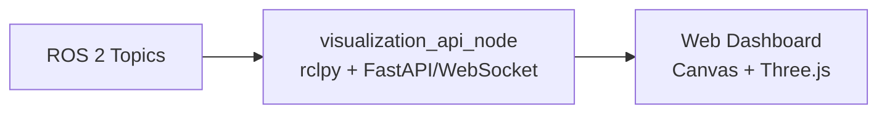

# SLAM 2.5D 可視化ツール要件定義書

対象リポジトリ: `/home/pi/MobileRobot`  
関連要件: `docs/SLAM_2.5D_requirement.md`  
対象方式: Step1 は **RViz2 ベース可視化**、将来拡張として **Web ダッシュボード**を定義する。

## 1. 目的

本ツールは、SLAM 2.5D システムの 2D Map、OctoMap、LiderModule 点群、LaserScan、TF、ロボット姿勢、Nav2 costmap、段差/穴検出状態を同一座標系で確認できる可視化環境を提供する。

Step1 では ROS 2 標準ツールである RViz2 を用い、開発・調整・実機試験・rosbag 再生確認に使える再現性の高い可視化プリセットを作成する。Web ダッシュボードは、運用者向けの軽量監視 UI として将来拡張扱いにする。

## 2. スコープ

### 2.1 Step1 対象

- RViz2 設定ファイルの作成
- RViz2 起動 launch の作成
- 2D Map と OctoMap の同時可視化
- `/scan`, `/lider/pointcloud2`, `/odom`, TF, RobotModel, Nav2 costmap の可視化
- hazard 状態を確認するための topic 表示
- 実機起動時と rosbag replay 時の両方で利用できる構成

### 2.2 将来拡張対象

- ブラウザで閲覧できる Web ダッシュボード
- 2D map の Canvas 表示
- 点群または OctoMap の Three.js 表示
- Topic health、hazard status、Nav2 状態の監視
- タブレットまたは別 PC からの軽量閲覧

### 2.3 対象外

- Step1 での独自 3D レンダリングエンジン実装
- Step1 での地図編集機能
- Step1 での経路指示 UI
- Step1 での OctoMap 解析アルゴリズム実装
- Web ダッシュボードからのロボット操作

## 3. 参照する既存ファイル

| ファイル | 用途 |
|---|---|
| `docs/SLAM_2.5D_requirement.md` | SLAM 2.5D 全体要件 |
| `mobile_robot_server/launch/server_bringup.launch.py` | SLAM / Nav2 / collision monitor 起動構成 |
| `mobile_robot_server/config/slam_toolbox_params.yaml` | `/map` と `map -> odom` の前提 |
| `mobile_robot_server/config/nav2_params.yaml` | Nav2 costmap / collision monitor の前提 |
| `mobile_robot_edge/mobile_robot_edge/lider_module_node.py` | `/scan`, `/lider/pointcloud2`, `/lider/imu` の topic 仕様 |
| `mobile_robot_edge/launch/ws_edge_bringup.launch.py` | edge 側 TF とセンサ起動構成 |

## 4. 可視化対象

Step1 の RViz2 では、以下を表示対象とする。

| 表示名 | Topic / Frame | 型 | 必須 | 用途 |
|---|---|---|---|---|
| TF | `/tf`, `/tf_static` | `tf2_msgs/msg/TFMessage` | 必須 | frame 接続確認 |
| RobotModel | `robot_description` | URDF | 必須 | ロボット姿勢確認 |
| 2D Map | `/map` | `nav_msgs/msg/OccupancyGrid` | 必須 | SLAM map 確認 |
| LaserScan | `/scan` | `sensor_msgs/msg/LaserScan` | 必須 | 水平 LiDAR 確認 |
| Lider PointCloud | `/lider/pointcloud2` | `sensor_msgs/msg/PointCloud2` | 必須 | 2.5D 点群確認 |
| Odometry | `/odom` | `nav_msgs/msg/Odometry` | 必須 | wheel odometry 確認 |
| Global Plan | `/plan` | `nav_msgs/msg/Path` | 推奨 | Nav2 経路確認 |
| Local Plan | controller 出力 path | `nav_msgs/msg/Path` | 任意 | controller 確認 |
| Global Costmap | `/global_costmap/costmap` | `nav_msgs/msg/OccupancyGrid` | 推奨 | 大域 costmap 確認 |
| Local Costmap | `/local_costmap/costmap` | `nav_msgs/msg/OccupancyGrid` | 推奨 | 局所 costmap 確認 |
| Voxel Markers | voxel layer 出力 | 環境依存 | 任意 | voxel layer 確認 |
| OctoMap | `/octomap_binary` または `/octomap_full` | `octomap_msgs/msg/Octomap` | 必須 | 3D 地図確認 |
| Hazard Status | `/hazard/downward_status` | `std_msgs/msg/String` | 推奨 | 段差/穴状態確認 |
| Cmd Vel | `/cmd_vel` | `geometry_msgs/msg/Twist` | 推奨 | 制御出力確認 |

## 5. RViz2 機能要件

### V-01 RViz2 プリセット

RViz2 設定ファイルを作成する。

成果物:

```text
mobile_robot_server/config/rviz/slam_25d.rviz
```

必須要件:

- Fixed Frame は `map` を既定とする。
- `map` が未生成のセンサ単体確認用に、Fixed Frame を `odom` へ切り替えやすい構成にする。
- Display は用途別にグループ化する。
- 起動直後に主要表示が有効であること。
- 重い表示は必要に応じて無効化できること。

推奨グループ:

| Group | Displays |
|---|---|
| Frames | TF, RobotModel |
| SLAM 2D | Map, LaserScan, Odometry |
| SLAM 2.5D | PointCloud2, OctoMap |
| Navigation | Global Costmap, Local Costmap, Global Plan, Local Plan |
| Safety | Hazard Status, Cmd Vel |

### V-02 RViz2 起動 launch

RViz2 を既定設定付きで起動する launch を作成する。

成果物:

```text
mobile_robot_server/launch/visualization_25d.launch.py
```

必須要件:

- `rviz2` executable を起動する。
- `rviz_config` launch argument で設定ファイルを差し替え可能にする。
- `use_sim_time` launch argument を持つ。
- rosbag replay 時は `use_sim_time:=true` で起動できること。
- GUI 環境がない場合にエラー理由が分かるよう README に注意を書くこと。

起動例:

```bash
ros2 launch mobile_robot_server visualization_25d.launch.py
ros2 launch mobile_robot_server visualization_25d.launch.py use_sim_time:=true
```

### V-03 2D Map 表示

`/map` を `Map` display で表示する。

必須要件:

- Topic は `/map`。
- Alpha は 0.7 から 1.0 の範囲で視認しやすくする。
- map 更新が途切れた場合、Topic status で確認できること。
- `slam_toolbox` 起動前でも RViz2 自体は起動できること。

受入基準:

- `slam_toolbox` 起動後、RViz2 上で OccupancyGrid が表示される。
- `map -> odom` TF が存在する状態で RobotModel と map が同一画面に表示される。

### V-04 OctoMap 表示

OctoMap を表示できる構成にする。

必須要件:

- `/octomap_binary` を第一候補 topic とする。
- 環境により `/octomap_full` も表示候補として用意する。
- RViz2 の OctoMap display plugin が必要な場合、依存 package を README に記載する。
- OctoMap 表示が利用できない環境でも、代替として `/lider/pointcloud2` を表示できること。

受入基準:

- `octomap_server` 起動後、RViz2 上で OctoMap または点群代替表示が確認できる。
- Fixed Frame `map` または `odom` で frame transform error が出ない。

### V-05 PointCloud2 表示

`/lider/pointcloud2` を表示する。

必須要件:

- Topic は `/lider/pointcloud2`。
- Style は `Points` または `Flat Squares`。
- Size は初期値 `0.02` m 程度。
- Color Transformer は `AxisColor` の `Z` または `Intensity` 相当を使用する。
- 点群が重い場合に Decay Time または Size を調整できること。

受入基準:

- `lider_module_node` 起動後、下向き点群が RViz2 で表示される。
- `/map`, RobotModel, `/lider/pointcloud2` の位置関係が TF 上で破綻しない。

### V-06 LaserScan 表示

`/scan` を表示する。

必須要件:

- Topic は `/scan`。
- Style は `Points`。
- Size は `0.03` m 程度。
- Color は 2D map と区別できる色にする。

受入基準:

- 実機または rosbag replay で、水平スキャンがロボット周囲に表示される。

### V-07 Nav2 costmap 表示

Nav2 の local/global costmap を表示する。

必須要件:

- `/global_costmap/costmap` を表示候補にする。
- `/local_costmap/costmap` を表示候補にする。
- local costmap は rolling window として robot 周辺に表示されること。
- voxel layer の効果確認のため、local costmap と `/lider/pointcloud2` を同時表示できること。

受入基準:

- `/scan` の障害物が local costmap に反映される。
- `/lider/pointcloud2` 由来の障害物が voxel layer 経由で local costmap に反映されることを目視確認できる。

### V-08 Safety / Hazard 表示

段差/穴検出状態と安全停止系の確認を行えるようにする。

必須要件:

- `/hazard/downward_status` を Topic display または別途簡易 monitor で確認できること。
- `/hazard/downward_stop` を確認できること。
- `/cmd_vel` を確認できること。
- collision monitor 起動時、出力 topic が確認できること。

受入基準:

- hazard node 未実装の場合でも RViz2 は起動できる。
- hazard node 実装後、状態 topic を同一プリセットで確認できる。

## 6. Launch / Package 要件

### 6.1 ファイル配置

Step1 の実装成果物は以下とする。

```text
mobile_robot_server/
  config/
    rviz/
      slam_25d.rviz
  launch/
    visualization_25d.launch.py
```

必要に応じて、`setup.py` または package install 設定に `config/rviz/*.rviz` と launch file が install されるよう追加する。

### 6.2 起動モード

| モード | コマンド例 | 用途 |
|---|---|---|
| 実機 SLAM 表示 | `ros2 launch mobile_robot_server visualization_25d.launch.py` | 通常確認 |
| rosbag replay 表示 | `ros2 launch mobile_robot_server visualization_25d.launch.py use_sim_time:=true` | 再現確認 |
| RViz 設定差替 | `ros2 launch mobile_robot_server visualization_25d.launch.py rviz_config:=/path/to/file.rviz` | 調整 |

### 6.3 依存 package

最低限:

- `rviz2`
- `robot_state_publisher`
- `tf2_ros`
- `slam_toolbox`
- `nav2_map_server`
- `nav2_costmap_2d`

OctoMap 表示用:

- `octomap_server`
- `octomap_msgs`
- RViz2 OctoMap display plugin を含む package

環境差があるため、OctoMap plugin 名は実装時に `ros2 pkg executables` と RViz2 plugin 一覧で確認する。

## 7. rosbag 対応要件

可視化検証用に、以下 topic を rosbag に記録できること。

```bash
/scan
/lider/pointcloud2
/lider/imu
/odom
/tf
/tf_static
/map
/octomap_binary
/octomap_full
/global_costmap/costmap
/local_costmap/costmap
/cmd_vel
/hazard/downward_status
/hazard/downward_stop
```

受入基準:

- 実機なしで rosbag replay し、RViz2 プリセットで `/map`, `/scan`, `/lider/pointcloud2`, TF が表示される。
- OctoMap topic が bag に含まれる場合、OctoMap も表示される。

## 8. Web ダッシュボード将来拡張要件

Web ダッシュボードは Step1 の必須成果物ではない。RViz2 でデバッグ用の表示項目が確定した後、運用者向けに軽量 UI として実装する。

### W-01 目的

Web ダッシュボードは、RViz2 を使わない利用者がブラウザからロボット状態、2D map、点群概要、OctoMap 概要、hazard 状態を確認できることを目的とする。

### W-02 想定構成



候補技術:

- backend: `rclpy` + `FastAPI` + WebSocket
- frontend: TypeScript, Canvas 2D, Three.js
- 2D map: OccupancyGrid を PNG または typed array に変換
- 3D: PointCloud2 を downsample して送信
- OctoMap: 初期は voxel/pointcloud 代替表示、必要時に OctoMap 変換を実装

### W-03 将来表示項目

| 表示 | 内容 |
|---|---|
| 2D Map | `/map` を平面表示 |
| Robot Pose | TF または `/odom` から姿勢表示 |
| LaserScan | `/scan` を 2D overlay |
| PointCloud | `/lider/pointcloud2` を downsample して 3D 表示 |
| OctoMap | 低解像度 voxel または点群代替表示 |
| Hazard | `SAFE`, `STEP_DOWN`, `HOLE`, `UNKNOWN` |
| Nav2 | goal, path, local/global costmap 概要 |
| Topic Health | topic 周期、最終受信時刻、欠落状態 |

### W-04 将来の非機能要件

- Raspberry Pi 上で backend が動作しても SLAM / Nav2 に大きな負荷を与えないこと。
- 点群は downsample、rate limit、範囲制限を必須とする。
- ブラウザ表示更新は 5 から 10 Hz を目標とする。
- 3D 点群は 1 から 2 Hz 程度に制限する。
- 操作系は初期実装では持たず、表示専用とする。
- 外部公開時は認証または LAN 内限定を必須とする。

## 9. 実装タスク定義

### VT-01 RViz2 設定作成

対象:

- `mobile_robot_server/config/rviz/slam_25d.rviz`

内容:

- Fixed Frame `map`
- TF, RobotModel, Map, LaserScan, PointCloud2, OctoMap, Costmap, Path, Odometry を登録
- 表示グループを整理
- 重い表示は無効化しやすくする

完了条件:

- RViz2 で設定を開き、主要 display が保存されている。

### VT-02 visualization launch 作成

対象:

- `mobile_robot_server/launch/visualization_25d.launch.py`

内容:

- `rviz2 -d slam_25d.rviz` を起動
- `rviz_config` と `use_sim_time` の launch argument を追加

完了条件:

- `ros2 launch mobile_robot_server visualization_25d.launch.py` で RViz2 が起動する。

### VT-03 package install 設定

対象:

- `mobile_robot_server/setup.py`

内容:

- `config/rviz/*.rviz` が install されるようにする。
- launch file が install されることを確認する。

完了条件:

- `colcon build --packages-select mobile_robot_server` 後、install share 配下に RViz 設定が配置される。

### VT-04 rosbag 可視化手順

対象:

- `docs` または `mobile_robot_server/README.md`

内容:

- rosbag record 対象 topic を記載
- rosbag replay + RViz2 起動手順を記載
- `use_sim_time:=true` の使い方を記載

完了条件:

- 実機なしで bag replay から可視化できる。

### VT-05 Web ダッシュボード設計メモ

対象:

- 将来用 docs

内容:

- RViz2 で確定した表示項目を Web UI 要件へ転記する。
- backend / frontend の責務を分ける。
- 表示専用、rate limit、downsample 方針を明記する。

完了条件:

- Web 実装着手前の仕様として参照できる。

## 10. 受入試験

| 試験 | 条件 | 合格基準 |
|---|---|---|
| RViz 起動 | GUI 環境あり | `visualization_25d.launch.py` で RViz2 が起動 |
| 2D Map 表示 | `/map` 配信あり | map が表示される |
| TF 表示 | `/tf`, `/tf_static` 配信あり | frame transform error がない |
| LaserScan 表示 | `/scan` 配信あり | ロボット周囲に scan が表示される |
| PointCloud 表示 | `/lider/pointcloud2` 配信あり | 下向き点群が表示される |
| OctoMap 表示 | `/octomap_binary` 配信あり | OctoMap または代替点群が表示される |
| Costmap 表示 | Nav2 起動済み | local/global costmap が表示される |
| rosbag 表示 | bag replay | 実機なしで map/scan/pointcloud/TF が表示される |
| 欠落耐性 | 一部 topic 未配信 | RViz2 自体は起動し、未配信 display の status で確認できる |

## 11. 完了の定義

Step1 は以下を満たした時点で完了とする。

- `mobile_robot_server/config/rviz/slam_25d.rviz` が存在する。
- `mobile_robot_server/launch/visualization_25d.launch.py` が存在する。
- RViz2 で `/map`, `/scan`, `/lider/pointcloud2`, TF, RobotModel を確認できる。
- OctoMap topic がある場合に表示、ない場合も PointCloud2 で 3D 情報を確認できる。
- Nav2 local/global costmap を表示できる。
- rosbag replay 時に `use_sim_time:=true` で確認できる。
- Web ダッシュボードは将来拡張として、本書の W-01 から W-04 に従う。
